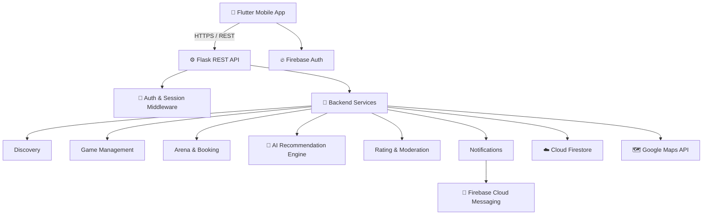
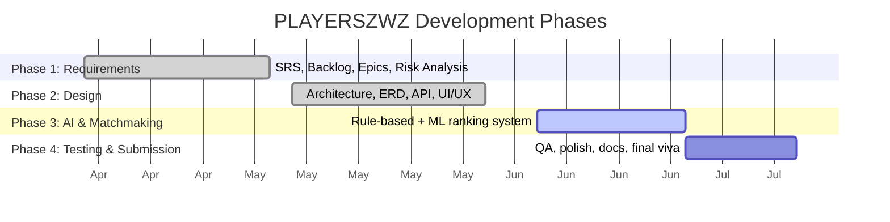

<div align="center">

# 🏆 PLAYERSZWZ

### AI-Powered Sports Matchmaking & Arena Booking App

*Find players. Fill teams. Book arenas. No more WhatsApp chaos.*

[](https://flutter.dev)
[](https://firebase.google.com)
[](https://flask.palletsprojects.com)
[](https://scikit-learn.org)


</div>

---

## 📌 The Problem

Organizing a casual cricket/futsal/badminton match today means **spamming WhatsApp groups**, **calling around for players**, and **guessing if a ground is even free**. Half the games fall apart because someone bails last-minute and there's no way to tell who's reliable.

**PLAYERSZWZ** fixes this with one mobile workflow: discover nearby players → create or join a game → book an arena → get notified → rate after the match.

---

## ✨ Core Features

| Module | What it does |
|---|---|
| 🔐 **Accounts & Profiles** | Secure signup/login, sport preferences, availability mode, search radius |
| 📍 **Nearby Discovery** | Geohash-based radius search for players & open games near you |
| 🎮 **Game Management** | Create games, send/approve join requests, live participant tracking |
| 🏟️ **Arena Booking** | Browse arenas, check slots, submit booking requests with live status |
| 🧠 **AI Recommendations** | Ranks games/players by preference, distance, history & reliability |
| ⭐ **Trust & Reliability** | Post-game ratings, no-show tracking, dispute-aware scoring |
| 🔔 **Notifications** | Push + in-app alerts for requests, approvals, reminders, bookings |
| 🛠️ **Admin Moderation** | Report review, warnings/suspensions, full audit log |

---

## 🏗️ Architecture



**Pattern:** Layered client-server — UI, API, domain services, and data are fully decoupled, so the rule-based recommendation engine can be swapped for a smarter ML model later without touching the app.

---

## 🧰 Tech Stack

<div align="center">

| Layer | Technology |
|:---:|:---:|
| **Frontend** | Flutter (Dart) |
| **Backend** | Flask (Python REST API) |
| **Database** | Cloud Firestore (NoSQL) |
| **Auth** | Firebase Authentication |
| **Maps** | Google Maps / Places API |
| **Notifications** | Firebase Cloud Messaging |
| **AI Engine** | scikit-learn (rule-based → ML ranking) |

</div>

---

## 📊 Project Roadmap



---

## 👥 Team — Group S26CS024

| Member | Role |
|---|---|
| **Waleed Abid** | Mobile architecture, backend integration, project coordination |
| **Afaq Ul Islam** | Scrum Master, frontend implementation, maps & UI flows |
| **Hassan Ahmed** | AI recommendation module, testing, documentation & QA |

**Product Owner:** Mr. Asif Farooq · **Institution:** University of Central Punjab — Faculty of IT & CS

---

## 📂 Repository Structure

```
playerszwz/
├── mobile/              # Flutter application
├── backend/             # Flask REST API + services
├── ai-engine/           # Recommendation logic (rule-based + ML)
├── docs/                # SRS, SDS, diagrams, IV&V reports
└── README.md
```

---

## 🚀 Getting Started

```bash
# Clone the repo
git clone https://github.com/<org>/playerszwz.git

# Backend setup
cd backend && pip install -r requirements.txt && flask run

# Mobile app setup
cd mobile && flutter pub get && flutter run
```

> Configure your own `.env` / `firebase_options.dart` with Firebase & Google Maps API keys — never commit credentials.

---

<div align="center">

**Built as a Final Year Project at the University of Central Punjab** 🎓

⭐ Star this repo if you'd rather book a ground than send 40 WhatsApp messages.

</div>
