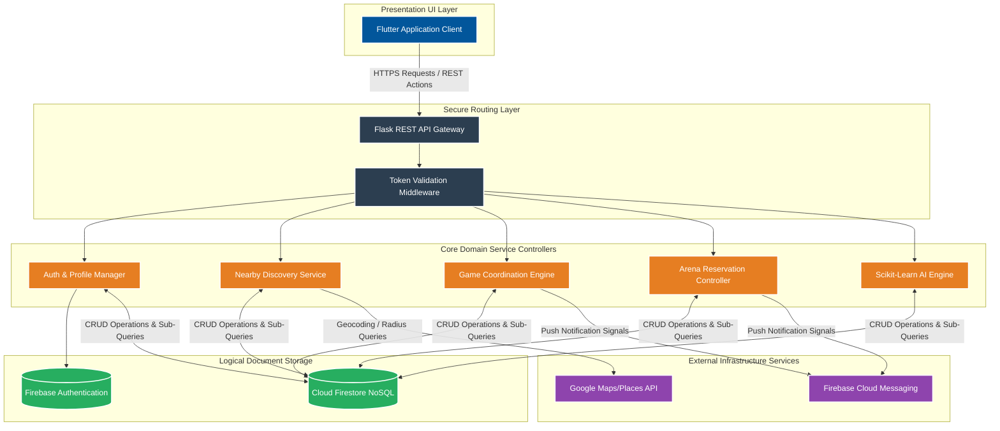

# PLAYERZWZ — AI-Powered Sports Matchmaking & Arena Booking Mobile Application

[](https://ucp.edu.pk/)
[](https://flutter.dev)
[](https://flask.palletsprojects.com/)
[](https://firebase.google.com/)
[](https://scikit-learn.org/)

An advanced, multi-layered client-server platform designed to completely mitigate coordination friction when planning casual sports matches and arranging arena reservations. By combining hyper-local geolocation filters with an offline rule-based and historical sequence-ranking engine, PLAYERZWZ matches players seamlessly based on sports profile preferences, real-time availability, proximity, and an auditable dependability trust system.

---

## 🏢 Academic Administration & Project Context
* **Institution:** University of Central Punjab (UCP), Lahore
* **Department:** Faculty of Information Technology & Computer Science
* **Group ID:** S26CS024
* **Product Owner / Project Supervisor:** Mr. Asif Farooq

### 👥 Group Matrix & Structural Responsibilities
| Member Name | Academic Registration | Core Functional Role | Specific Modules Handled |
| :--- | :--- | :--- | :--- |
| **Afaq Ul Islam** | L1F21BSCS0951 | Scrum Master & Frontend Lead | Flutter Mobile UI Flow, Maps/Location Service APIs, Preference Vectors. |
| **Waleed Abid** | L1F24PACS0021 | Architecture & Backend Engineer | App Layer Architecture, Flask REST API Development, Firestore Schema Integration. |
| **Hassan Ahmed** | L1F22BSCS1053 | AI Engineer & Quality Assurance | Scikit-learn Matchmaking Algorithm, Verification Testing, Technical Documentation. |

---

## 📊 System Architecture & Component Interactions

The following visual layout defines the interaction maps running between the presentation layer, our Flask REST API gateway, business domain components, data tables, and third-party operational dependencies:



---

## ⏱️ Dual-Semester Sprint Roadmap & Milestones

This structured timeline displays the execution phases across both academic terms, highlighting requirements mapping, prototype assembly, model deployment, and regression validation steps:

```mermaid
gantt
    title PLAYERZWZ - Agile Project Timeline (Phase I to Phase IV)
    dateFormat X
    axisFormat %d
    
    section Semester 1: Planning & Architecture
    Requirement Engineering (Phase I SRS)     :active, s1, 0, 30
    System Design & Architecture (Phase II SDS) :active, s2, 30, 60
    Toolchain Matrix & Sandbox Structuring    :s3, 60, 90
    
    section Semester 2: Implementation & Validation
    Flask Core REST Endpoints Assembly        :s4, 90, 150
    Flutter Interfaces & Navigation Matrix     :s5, 120, 180
    AI Logic Module & Scikit-Learn Training    :s6, 160, 240
    Asynchronous System Integration            :s7, 200, 270
    QA Validation & Final Thesis Deployment   :s8, 240, 360
```



---

## 🛠️ Advanced Technical Subsystem Blueprint

### 📱 1. Client-Side Framework (Flutter)
* **Design Guideline Implementation:** Strict state validation patterns separating responsive interactive UI configurations from pure operational logic loops.
* **Geolocation Fail-safes:** Built-in structural permission handshakes. If terminal location telemetry is explicitly denied by the user, the map workflow falls back immediately to manual grid text entry parameters to preserve availability indexing.

### ⚙️ 2. Business Logic API Routing (Flask)
* **Modular Codebase Paradigm:** Distinct controllers handle isolated structural routes, keeping endpoints clear, decoupled, and easy to extend.
* **Session Integrity Checking:** Custom API routing interception filters. Every state-altering sequence requires complete parsing of bearer auth signature hashes to verify role privileges before execution.

### 🧠 3. Intelligence Model Architecture (Scikit-Learn)
* **Sequence-Ranking Engine:** Combines explicit preference vectors, historical participation habits, geographic distance, and real-time availability to score and rank optimal matches.
* **Cold-Start Fallback Solution:** To support new users without historical telemetry data, the engine uses a custom rule-based fallback routine to provide targeted matchmaking based purely on immediate location constraints and declared favorite sports.

---

## 📈 System Execution Matrix & Performance Profiles

The data matrix below defines our strict non-functional constraints, testing boundaries, and operational thresholds designed to ensure stability under heavy testing workloads:

```text
=====================================================================================
CRITICAL SYSTEM PERFORMANCE THRESHOLDS
=====================================================================================
[Dashboard Load Time]               | < 3.0 Seconds (On standard UCP/Home network)
[Proximity Lookup Matrix]           | < 5.0 Seconds (Radius filter calculations)
[AI Matchmaking Fallback Execution] | < 3.0 Seconds (Rule-based cold start matching)
[AI Personalized Rank Processing]   | < 6.0 Seconds (Historical pipeline computation)
[Max Target Mock Concurrency]      | 50 Concurrent active academic test sessions
=====================================================================================
```

| Metric / Scenario ID | Verified Target Scope | Expected Output Integrity | Mitigation Rule Logic |
| :--- | :--- | :--- | :--- |
| **TD-04: Location Blackout** | Explicit permission denial | Manual input form fallback activated | Maintain structural integrity through explicit coordinate parameters. |
| **TD-06: Request Flooding** | Duplicate check on join events | Rejects consecutive array mutations | Uses strict query isolation checks to prevent duplicate entries. |
| **TD-08: Schedule Conflict** | Double booking validation | Transaction block execution | Locks slot status to "Pending" during confirmation to prevent double booking. |

---

## ⚙️ Directory Structure & Repository Layout

```text
PLAYERZWZ-Sports-Matchmaking-App/
├── .gitignore                   # Universal exclusion rule ledger (Python/Dart/OS cache)
├── README.md                    # Core architectural roadmap & overview document
├── docs/                        # Formal academic artifacts and planning deliverables
│   ├── Phase_I_SRS.pdf          # Approved Software Requirements Specification
│   └── Phase_II_SDS.pdf         # Finalized Agile Software Design Specification
├── frontend_tracker/            # Cross-platform client interface framework (Flutter)
│   ├── lib/                     # Modular Dart sources (UI views, layout maps, states)
│   └── pubspec.yaml             # External plugin tree declarations
├── backend_api/                 # Business logic processing environment (Flask REST)
│   ├── app.py                   # Central server entry point 
│   ├── routes/                  # Controller blueprints (auth, discovery, scheduling)
│   └── requirements.txt         # Core dependencies index
└── ai_engine/                   # Machine learning computational tracking environment
    └── model.py                 # Scikit-learn sequence rank computation routines
```

---

## 🚀 Workspace Local Sandbox Launch Routine

### Step 1: Clone the Project Repository
```bash
git clone [https://github.com/afaqamir01-lab/PLAYERZWZ-Sports-Matchmaking-App.git](https://github.com/afaqamir01-lab/PLAYERZWZ-Sports-Matchmaking-App.git)
cd PLAYERZWZ-Sports-Matchmaking-App
```

### Step 2: Initialize and Launch the Flask REST Gateway
```bash
cd backend_api
python3 -m venv venv
source venv/bin/activate  # On Windows use: venv\Scripts\activate
pip install -r requirements.txt
python app.py
```

### Step 3: Initialize and Run the Flutter Mobile UI Client
```bash
cd ../frontend_tracker
flutter pub get
flutter run
```
