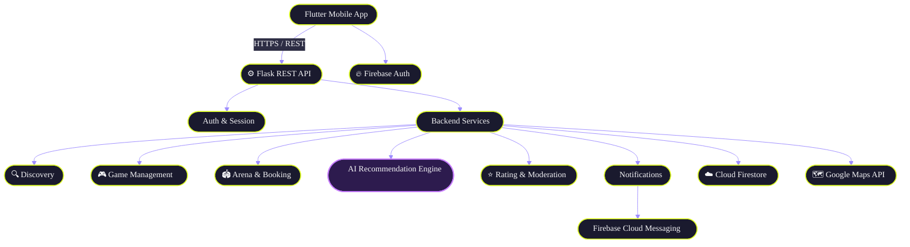
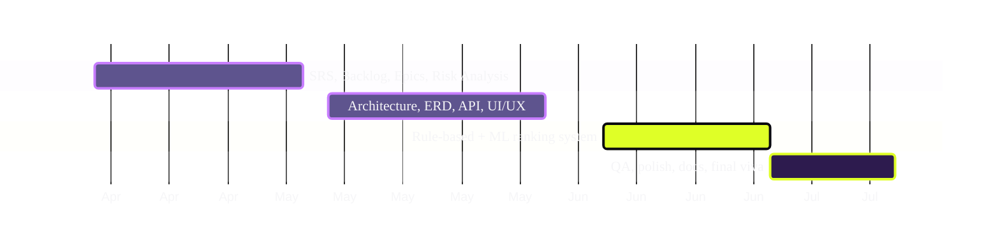

<div align="center">


### AI-Powered Sports Matchmaking & Arena Booking App

*Find players. Fill teams. Book arenas. No more WhatsApp chaos.*
<br/>


<br/><br/>


</div>

<br/>

---

## 📌 The Problem

Organizing a casual cricket/futsal/badminton match today means **spamming WhatsApp groups**, **calling around for players**, and **guessing if a ground is even free**. Half the games fall apart because someone bails last-minute and there's no way to tell who's reliable.

**PLAYERSZWZ** fixes this with one mobile workflow: discover nearby players → create or join a game → book an arena → get notified → rate after the match.

---

## ✨ Core Features

<table>
<tr>
<td width="50%" valign="top">

### 🔐 Accounts & Profiles
Secure signup/login, sport preferences, availability mode, and adjustable search radius — all synced to a single trust-aware profile.

</td>
<td width="50%" valign="top">

### 📍 Nearby Discovery
Geohash-powered radius search surfaces compatible players and open games around you, with map and list views.

</td>
</tr>
<tr>
<td width="50%" valign="top">

### 🎮 Game Management
Create games, send or approve join requests, and track live participant counts and capacity in real time.

</td>
<td width="50%" valign="top">

### 🏟️ Arena Booking
Browse nearby arenas, check open slots, and submit booking requests with live Pending → Approved status.

</td>
</tr>
<tr>
<td width="50%" valign="top">

### 🧠 AI Recommendations
Ranks games and players using preference, proximity, history, and reliability — rule-based first, ML-enhanced later.

</td>
<td width="50%" valign="top">

### ⭐ Trust & Reliability
Post-game ratings, no-show tracking, and a dispute-aware reliability score that's fair by design.

</td>
</tr>
<tr>
<td width="50%" valign="top">

### 🔔 Notifications
Push + in-app alerts for join requests, approvals, booking updates, and game reminders.

</td>
<td width="50%" valign="top">

### 🛠️ Admin Moderation
Report review workflow with warnings, suspensions, and a fully logged audit trail.

</td>
</tr>
</table>

---

## 🏗️ Architecture



**Pattern:** Layered client-server — UI, API, domain services, and data are fully decoupled, so the rule-based recommendation engine can be swapped for a smarter ML model later without touching the app.

---

## 🧰 Tech Stack

<div align="center">

| Layer | Stack |
|:---|:---|
| **Frontend** |  |
| **Backend** |  |
| **Database** |  |
| **Auth** |  |
| **Maps** |  |
| **Notifications** |  |
| **AI Engine** |  |

</div>

---

## 📊 Project Roadmap



---

## 👥 Team — Group S26CS024

<table>
<tr>
<td align="center" width="33%">

**🧑‍💻 Waleed Abid**
<br/>

<br/><br/>
Backend integration · Project coordination

</td>
<td align="center" width="33%">

**🎯 Afaq Ul Islam**
<br/>

<br/><br/>
Frontend · Maps & UI flows

</td>
<td align="center" width="33%">

**🧠 Hassan Ahmed**
<br/>

<br/><br/>
Recommendation module · Testing & docs

</td>
</tr>
</table>

<div align="center">

**Product Owner:** Mr. Asif Farooq &nbsp;·&nbsp; **Institution:** University of Central Punjab — Faculty of IT & CS

</div>

---

## 📂 Repository Structure

```
playerszwz/
├── mobile/              # Flutter application
├── backend/             # Flask REST API + services
├── ai-engine/           # Recommendation logic (rule-based + ML)
├── docs/                # SRS, SDS, diagrams, IV&V reports
└── README.md
```

---

## 🚀 Getting Started

```bash
# Clone the repo
git clone https://github.com/<org>/playerszwz.git

# Backend setup
cd backend && pip install -r requirements.txt && flask run

# Mobile app setup
cd mobile && flutter pub get && flutter run
```

> Configure your own `.env` / `firebase_options.dart` with Firebase & Google Maps API keys — never commit credentials.

---

<div align="center">

**Built as a Final Year Project at the University of Central Punjab** 🎓

⭐ Star this repo if you'd rather book a ground than send 40 WhatsApp messages.

</div>
